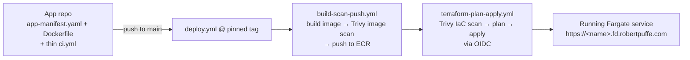
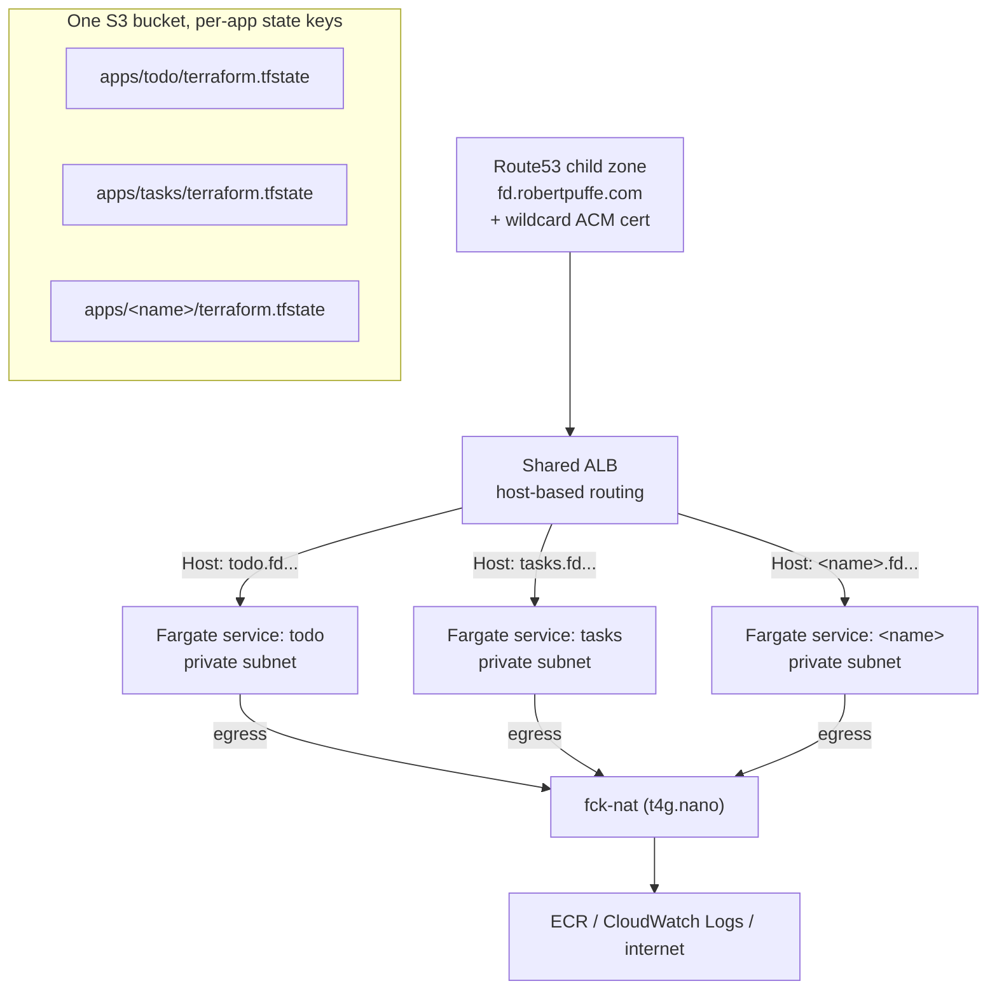

# flightdeck

flightdeck is a golden path from a plain-language app spec to a production-grade
AWS deployment: Terraform modules, reusable GitHub Actions, and an
`app-manifest.yaml` contract that a coding agent can satisfy without ever
touching AWS, Terraform, or DNS. Two apps built this way are live right now —
[todo.fd.robertpuffe.com](https://todo.fd.robertpuffe.com) and
[tasks.fd.robertpuffe.com](https://tasks.fd.robertpuffe.com) — each taken from
spec to a verified URL end-to-end by a cold coding agent given nothing but the
spec and the contract. The most recent run, on the current contract version,
went spec-to-URL in **6m38s with zero CI failures** (§9 of the
[spec](spec-docs/flightdeck-spec.md); full run log in
[spec-docs/failure-log.md](spec-docs/failure-log.md)).

## How it works

**Deploying an app** — a push to `main` in an app repo runs the platform's
reusable workflows over OIDC, no long-lived credentials anywhere:



**Runtime topology** — every app lands behind one shared ALB, in private
subnets, with its own Terraform state key in one shared bucket:



## The contract

An app repo is a Dockerfile, an `app-manifest.yaml`, and two files of
platform boilerplate it never edits (`main.tf`, `ci.yml`). The manifest is
the *only* file with app-specific infra facts — every field earned its way
in by being needed during the Stage 1 manual deploy (spec §6):

```yaml
# app-manifest.yaml
name: my-app            # dns-safe, becomes service/log/target-group names + URL host
port: 8080
healthcheck: /healthz    # must return 200 within 30s of start
cpu: 256                 # fargate units
memory: 512
env:                      # non-secret config only
  LOG_LEVEL: info
```

The agent-facing side of the contract (v0.2.0) is a ~20-line `AGENTS.md`/
`CLAUDE.md` index, task-scoped docs read on demand (`docs/contract.md`,
`docs/dockerfile.md`, `docs/pipeline.md`, `docs/example.md`), the manifest's
JSON Schema, and `make preflight`, which mirrors CI's exact gates locally. It
replaced an earlier single `CONVENTIONS.md` monolith: loading context per
task instead of memorizing it all upfront, and catching failures locally in
seconds instead of a multi-minute CI round-trip, measurably changed the
outcome (see Measured results below).

## Quickstart

1. **Bootstrap once** (account-level, applied by a human — spec §5b): copy
   `bootstrap/example.tfvars` to `bootstrap/bootstrap.auto.tfvars`, fill in
   your alert email, then `make bootstrap`.
2. **Onboard an app**: add its name to the `apps` registry in
   `bootstrap/variables.tf`, re-run `make bootstrap` (this creates its ECR
   repo), create the app's repo from the `template-app` GitHub template, and
   set one repo variable (`FLIGHTDECK_DEPLOY_ROLE_ARN`).
3. **Build the app**: write the code yourself, or hand a coding agent the app
   spec plus the repo — the contract (`AGENTS.md`, schema, `make preflight`)
   is all the context it needs.
4. **Push to `main`.** That's the deploy trigger; the app is live at
   `https://<name>.fd.robertpuffe.com` a few minutes later.

## Security defaults

- **OIDC only** — the deploy role is assumed via GitHub's OIDC federation
  (`bootstrap/oidc.tf`); no long-lived AWS access keys exist anywhere, in any
  repo or secret store.
- **Trivy image + IaC gates, HIGH/CRITICAL only** — a deliberate, documented
  threshold (checkov's open-source tier can't filter by severity; Trivy can).
  The image gate isn't theoretical: it caught a real fixable CVE
  (CVE-2026-33630, c-ares) in a *current* official `nginx-unprivileged` base
  image on its first run (failure log #2).
- **Permissionless task roles** — an app's ECS task role has no AWS API
  permissions attached in v1; there is nothing for a compromised container to
  reach into.
- **ALB-only ingress, private subnets** — app services have no public IPs and
  accept traffic only from the shared ALB's security group; egress runs
  through fck-nat.
- **Prefix + tag conventions, state-scoped destroys** — every resource is
  named `flightdeck-*` and tagged `project=flightdeck`; `make destroy`
  targets flightdeck's own Terraform state only, never a tag-based or
  account-wide sweep, so it can't reach a pre-existing resource even by
  accident.

## Measured results

Two timed, cold-agent runs of the same protocol (spec + contract, handed to a
fresh Claude Code session, no human help beyond diagnosis review):

| Run | Contract | Time (spec → verified URL) | CI failures |
|---|---|---|---|
| `todo` | v0.1.x, monolithic `CONVENTIONS.md` | 8m18s | 1 (agent self-fixed) |
| `tasks` | v0.2.0, contract-as-tool | 6m38s | 0 (1 issue, caught locally by `make preflight` in seconds) |

The full [failure log](spec-docs/failure-log.md) has six entries — four
platform-side (found while hardening the pipeline), two agent-loop-side.
Every one patched either the platform or the contract; none were worked
around in an app repo. That's the hardening loop the log is meant to show:
failures under real use, not a spec written in a vacuum.

## Cost

Idle, with nothing actively deployed beyond the shared platform pieces:

- fck-nat (t4g.nano NAT instance): ~$3/mo, vs ~$32+/mo for a managed NAT
  Gateway. Documented availability tradeoff — a single instance, no HA; if
  its AZ fails, private-subnet egress is down until it's replaced. Cost over
  availability, acceptable for a personal platform (spec §5, `bootstrap/vpc.tf`).
- One shared ALB: ~$16/mo, amortized across every app behind it.
- Fargate: ~$9/mo per always-on 256 CPU / 512 MB task.
- A budget alarm fires at $30/mo (`bootstrap/platform.tf`).
- `make destroy-bootstrap` (and the per-app destroy targets) tear the stack
  down cleanly when not demoing — verified, not just claimed: a
  `terraform destroy` of the `hello` stack completed with
  "Destroy complete! Resources: 13 destroyed", the neighboring `todo` app
  kept serving 200s throughout (zero blast radius to the rest of the
  platform), and the pre-existing parent DNS zone came out of it with its
  original records plus exactly the one NS delegation record — untouched
  otherwise.

## Cross-agent compatibility

Stage 4 of the spec: the same spec and contract run through more than one
coding agent to check whether the platform's guardrails hold up regardless
of which agent is generating the code.

| Agent | Result | Time | CI failures |
|---|---|---|---|
| Claude Code (Sonnet) — v0.1.x contract | pass | 8m18s | 1 (self-fixed) |
| Claude Code (Sonnet) — v0.2.0 contract | pass | 6m38s | 0 |
| Cursor | pending | — | — |
| (one other agent) | pending | — | — |

## What I deliberately didn't build (spec §4)

- **No CLI.** The interface is a Makefile plus standard tools (terraform,
  gh, docker) — nothing to install, nothing hiding what's actually running.
- **No portal or service catalog.** This is one golden path, not an internal
  developer platform.
- **No Kubernetes.** ECS/Fargate only — the platform serves one workload
  shape well rather than every shape partially.
- **No multi-language build matrix.** If it builds a Docker image and
  answers a health check, it qualifies; the platform stays language-agnostic
  by staying out of the language's business entirely.
- **No escape hatches.** Deviating from the contract means stepping off the
  platform. Deliberate — a sanctioned escape hatch is a design problem on its
  own (parked in the roadmap, not solved here).
- **No day-2 operations** beyond basic alarms — no upgrade tooling, no
  dashboards. Named future work, not an oversight.

## Future work

See the [spec's roadmap](spec-docs/flightdeck-spec.md#11-roadmap--v2-and-beyond-parking-lot)
for the full parking lot. A few near-term items:

- **Secrets injection via SSM Parameter Store** — the manifest currently has
  no `secrets:` field; v1 apps take config from non-secret env vars only.
- **Multi-environment promotion** — dev → prod from the same manifest, the
  single biggest realism upgrade the platform is missing.
- **Second service type (worker/cron)** — proves the manifest contract
  generalizes past always-on web services.
- **Cross-agent matrix as a living benchmark** — rerun the Stage 4 spec
  against new agent releases on a regular cadence instead of once.
