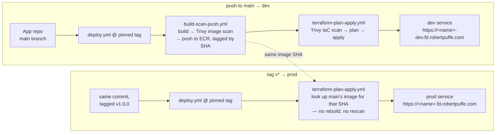
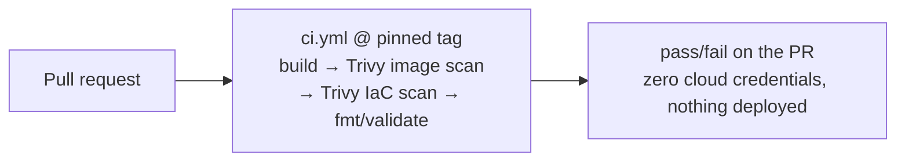
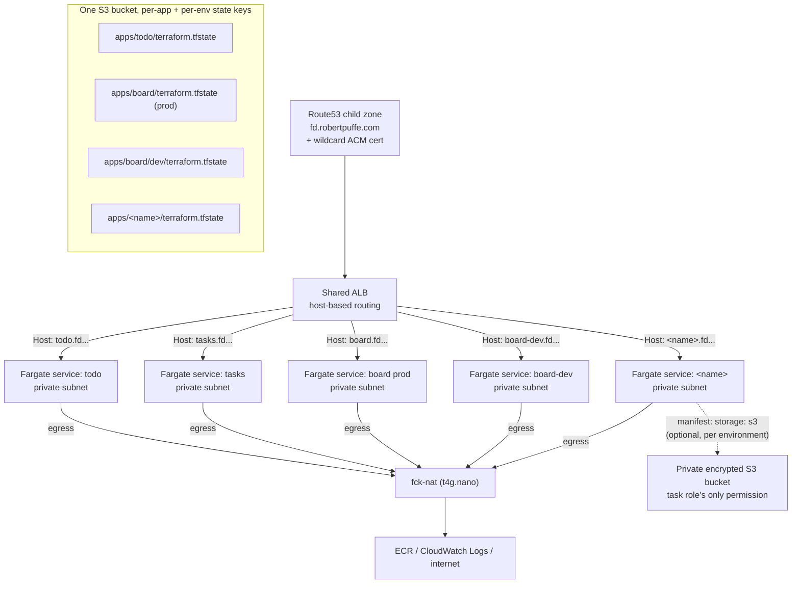

# flightdeck

flightdeck is a golden path from a plain-language app spec to a production-grade
AWS deployment: Terraform modules, reusable GitHub Actions, and an
`app-manifest.yaml` contract that a coding agent can satisfy without ever
touching AWS, Terraform, or DNS. Three apps built this way are live right now —
[todo](https://todo.fd.robertpuffe.com), [tasks](https://tasks.fd.robertpuffe.com),
and [board](https://board.fd.robertpuffe.com) — each taken from spec to a
verified URL end-to-end by a cold coding agent given nothing but the spec and
the contract. The best run, `tasks`, went spec-to-URL in **6m38s with zero CI
failures**; the most recent run, `board` — a frontend-plus-API shape the
platform had never built before — matched that with **zero failures anywhere**
(build, scan, or local preflight) in 8m19s (§9 of the
[spec](spec-docs/flightdeck-spec.md); full run log in
[spec-docs/failure-log.md](spec-docs/failure-log.md)). Since that first
contract, the platform grew a full pipeline — pull requests run credential-free
checks, pushes to `main` deploy a dev environment, version tags promote the
exact same image to prod — plus optional per-app S3 storage and a one-command
lifecycle for both the platform and app repos (`make new-app`, `make upgrade`).
Current tag: **v0.5.0**.

(Live-app availability varies — services get scaled to zero between demos via
`make stop`/`make stop-all`, and the next deploy silently restores them.
`hello`, the Stage 1 worked example, stays destroyed on purpose: it's the
teardown proof, see Cost below.)

## How it works

**Deploying an app** — three triggers, over OIDC, no long-lived credentials
anywhere:



Pull requests never reach either path — OIDC trust is scoped to
`refs/heads/main` and `refs/tags/v*` only, so an unmerged PR gets checks, not
credentials:



**Runtime topology** — every app lands behind one shared ALB, in private
subnets, with its own Terraform state key (per environment) in one shared
bucket; storage is opt-in and, when set, scoped to exactly one app's own
bucket:



## The contract

An app repo is a Dockerfile, an `app-manifest.yaml`, and two files of
platform boilerplate it never edits (`main.tf`, `ci.yml`). The manifest is
the *only* file with app-specific infra facts — every field earned its way
in by being needed during a real deploy (spec §6):

```yaml
# app-manifest.yaml
name: my-app             # dns-safe, max 16 chars, becomes service/log/target-group names + URL host
port: 8080
healthcheck: /healthz    # must return 200 within 30s of start
cpu: 256                 # fargate units
memory: 512
env:                      # non-secret config only
  LOG_LEVEL: info
storage: s3               # optional — private per-env bucket, injected as STORAGE_BUCKET
```

`storage: s3` is the first post-v1 field (v0.4.0), added because a real app
needed durable state, per §6's rule. Setting it creates a private encrypted
bucket per environment, grants the task role access to exactly that bucket —
its first and only AWS permission — and injects `STORAGE_BUCKET`. Absent, the
platform behaves byte-identically to before the field existed.

The agent-facing side of the contract (v0.2.0) is a ~20-line `AGENTS.md`/
`CLAUDE.md` index, task-scoped docs read on demand (`docs/contract.md`,
`docs/dockerfile.md`, `docs/pipeline.md`, `docs/example.md`), the manifest's
JSON Schema, and `make preflight`, which mirrors CI's exact gates locally. It
replaced an earlier single `CONVENTIONS.md` monolith: loading context per
task instead of memorizing it all upfront, and catching failures locally in
seconds instead of a multi-minute CI round-trip, measurably changed the
outcome (see Measured results below).

The contract extends past day-1 setup into day-2 lifecycle, still as a
Makefile target rather than a new tool (v0.5.0): `make new-app NAME=x` in the
platform repo scaffolds a conforming app repo and registers it in the ECR
bootstrap registry in one command; `make upgrade` in an app repo replaces
every platform-owned file with the latest tagged release in one operation —
refs bump as a side effect, since the template at a given tag pins itself —
and refuses to run over any uncommitted change to a platform-owned path;
`.flightdeck-version` plus a preflight check warn (never fail) when an app's
pinned ref has drifted from its recorded version. Neither command commits on
the app's behalf — review and commit stays a deliberate human step, same as
any dependency bump.

## Quickstart

1. **Bootstrap once** (account-level, applied by a human — spec §5b): copy
   `bootstrap/example.tfvars` to `bootstrap/bootstrap.auto.tfvars`, fill in
   your alert email, then `make bootstrap`.
2. **Onboard an app**: `make new-app NAME=my-app` scaffolds `../my-app` from
   `template-app/`, sets its manifest name, `git init`s it, and registers it
   in the `apps` list in `bootstrap/variables.tf` — one command, replacing
   what used to be manual copying. It prints the remaining deliberate steps:
   `make bootstrap` (creates the app's ECR repo), `gh repo create`, and
   setting one repo variable (`FLIGHTDECK_DEPLOY_ROLE_ARN`).
3. **Build the app**: write the code yourself, or hand a coding agent the app
   spec plus the repo — the contract (`AGENTS.md`, schema, `make preflight`)
   is all the context it needs.
4. **Push to `main`.** That deploys dev, at
   `https://<name>-dev.fd.robertpuffe.com`, a few minutes later. **Tag `v*`**
   on that same commit to promote the identical image to prod, at
   `https://<name>.fd.robertpuffe.com` — no rebuild.

## Security defaults

- **OIDC only** — the deploy role is assumed via GitHub's OIDC federation
  (`bootstrap/oidc.tf`); no long-lived AWS access keys exist anywhere, in any
  repo or secret store.
- **Credential-free PR checks** — OIDC trust covers only `refs/heads/main` and
  `refs/tags/v*`; a pull request runs the full build + scan + fmt/validate
  gate with zero cloud credentials, so unmerged code can never reach AWS,
  deploy anything, or read Terraform state.
- **Trivy image + IaC gates, HIGH/CRITICAL only** — a deliberate, documented
  threshold (checkov's open-source tier can't filter by severity; Trivy can).
  The image gate isn't theoretical: it caught a real fixable CVE
  (CVE-2026-33630, c-ares) in a *current* official `nginx-unprivileged` base
  image on its first run (failure log #2).
- **Permissionless task roles, one narrow opt-in exception** — an app's ECS
  task role has no AWS API permissions by default. The only way to get any is
  setting `storage: s3` in the manifest, which grants access to exactly that
  app's own per-environment bucket (list/get/put/delete) and nothing else in
  the account.
- **ALB-only ingress, private subnets** — app services have no public IPs and
  accept traffic only from the shared ALB's security group; egress runs
  through fck-nat.
- **Prefix + tag conventions, state-scoped destroys** — every resource is
  named `flightdeck-*` and tagged `project=flightdeck`; `make destroy`
  targets flightdeck's own Terraform state only, never a tag-based or
  account-wide sweep, so it can't reach a pre-existing resource even by
  accident.

## Measured results

Three timed, cold-agent runs of the same protocol (spec + contract, handed to
a fresh Claude Code session, no human help beyond diagnosis review):

| Run | Contract | App shape | Time (spec → verified URL) | CI failures |
|---|---|---|---|---|
| `todo` | v0.1.x, monolithic `CONVENTIONS.md` | API only | 8m18s | 1 (agent self-fixed) |
| `tasks` | v0.2.0, contract-as-tool | API only | 6m38s | 0 (1 issue, caught locally by `make preflight`) |
| `board` | v0.2.0 contract, v0.3.0 pipeline | frontend + API, one container | 8m19s | 0 (zero failures anywhere — build, scan, or preflight) |

The v0.3.0 pipeline itself was proven live on the `board` run, not just
described: a push built and deployed dev, then tagging that same commit
promoted prod to the **byte-identical image SHA** main had just built — no
rebuild (failure log, v0.3.0 pipeline proof).

The full [failure log](spec-docs/failure-log.md) has six numbered entries —
four platform-side (found while hardening the pipeline), two agent-loop-side
— plus the v0.3.0 pipeline proof and the `board` shape-generality run. Every
one patched either the platform or the contract; none were worked around in
an app repo. That's the hardening loop the log is meant to show: failures
under real use, not a spec written in a vacuum.

## Cross-agent compatibility

Stage 4 of the spec: the same spec and contract run through more than one
coding agent to check whether the platform's guardrails hold up regardless
of which agent is generating the code.

| Agent | Result | Time | CI failures |
|---|---|---|---|
| Claude Code (Sonnet) — v0.1.x contract, `todo` | pass | 8m18s | 1 (self-fixed) |
| Claude Code (Sonnet) — v0.2.0 contract, `tasks` | pass | 6m38s | 0 |
| Claude Code (Sonnet) — v0.2.0 contract + v0.3.0 pipeline, `board` | pass | 8m19s | 0 |
| Cursor | pending | — | — |
| (one other agent) | pending | — | — |

## What I deliberately didn't build (spec §4)

- **No CLI.** The interface is a Makefile plus standard tools (terraform,
  gh, docker) — nothing to install, nothing hiding what's actually running.
- **No portal or service catalog.** This is one golden path, not an internal
  developer platform.
- **No Kubernetes.** ECS/Fargate only — the platform serves one workload
  shape well rather than every shape partially.
- **No multi-language build matrix.** If it builds a Docker image and
  answers a health check, it qualifies; the platform stays language-agnostic
  by staying out of the language's business entirely.
- **No escape hatches.** Deviating from the contract means stepping off the
  platform. Deliberate — a sanctioned escape hatch is a design problem on its
  own (parked in the roadmap, not solved here).
- **No day-2 operations beyond basic alarms and app lifecycle.** `make
  new-app` and `make upgrade` (v0.5.0) cover scaffolding and platform-version
  upgrades — graduated out of this list by an explicit owner decision (spec
  §10), not scope creep. Dashboards, drift detection, and deploy strategies
  stay out, still named future work.

## Cost

Idle, with nothing actively deployed beyond the shared platform pieces:

- fck-nat (t4g.nano NAT instance): ~$3/mo, vs ~$32+/mo for a managed NAT
  Gateway. Documented availability tradeoff — a single instance, no HA; if
  its AZ fails, private-subnet egress is down until it's replaced. Cost over
  availability, acceptable for a personal platform (spec §5, `bootstrap/vpc.tf`).
- One shared ALB: ~$16/mo, amortized across every app behind it.
- Fargate: ~$9/mo per always-on 256 CPU / 512 MB task — and each environment
  is its own task, so an app running both dev and prod costs ~$18/mo, not $9.
  `make stop SVC=<name>` / `make start SVC=<name>` scale one service to 0/1;
  `make stop-all` / `make start-all` do the same across the whole cluster —
  a deliberate overnight off-switch. Terraform state still says
  `desired_count=1`, so that service's next deploy silently restores it:
  documented drift, not a bug.
- A budget alarm fires at $30/mo (`bootstrap/platform.tf`).
- `make destroy-bootstrap` (and the per-app destroy targets) tear the stack
  down cleanly when not demoing — verified, not just claimed: a
  `terraform destroy` of the `hello` stack completed with
  "Destroy complete! Resources: 13 destroyed", the neighboring `todo` app
  kept serving 200s throughout (zero blast radius to the rest of the
  platform), and the pre-existing parent DNS zone came out of it with its
  original records plus exactly the one NS delegation record — untouched
  otherwise.

## Future work

See the [spec's roadmap](spec-docs/flightdeck-spec.md#11-roadmap--v2-and-beyond-parking-lot)
for the full parking lot. A few near-term items:

- **Secrets injection via SSM Parameter Store** — the manifest currently has
  no `secrets:` field; v1 apps take config from non-secret env vars only.
- **Plan preview on PRs via a read-only plan role** — PR checks are
  deliberately credential-free (see Security defaults); a separate role with
  read-only + state-read permissions would let `terraform plan` comment on a
  PR without handing write credentials to unmerged code.
- **Second service type (worker/cron)** — proves the manifest contract
  generalizes past always-on web services.
- **RDS/Aurora module** — an optional `database:` block, inheriting the
  shape `storage: s3` proved out: conditional resources, a scoped task-role
  grant, an injected env var.
- **Cross-agent matrix as a living benchmark** — rerun the Stage 4 spec
  against new agent releases on a regular cadence instead of once.
